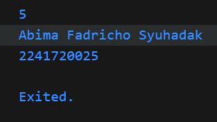
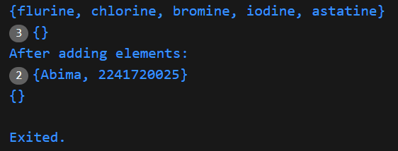
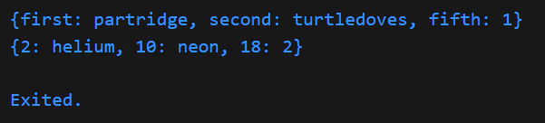
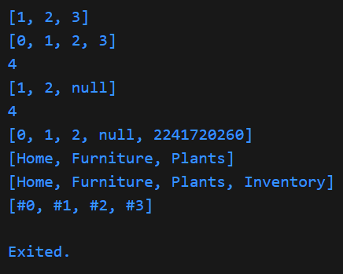
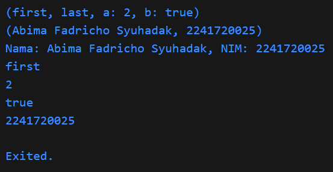

**Praktikum 1**         
  
jawaban langkah 2: assert digunakan untuk memastikan bahwa panjang list (list.length) sama dengan 3. Jika kondisinya tidak benar, akan muncul error. Namun, karena panjang list memang 3, tidak ada error yang terjadi.  
Jawaban langkah 3: Kode ini membuat list berukuran 5 elemen, kemudian mengisi elemen di index 1 dengan nama dan index 2 dengan NIM. Fungsi assert digunakan untuk memeriksa apakah panjang lst dan isinya benar, dan jika tidak ada error panjang list serta elemen di index 1 dan 2 dicetak.  
**Praktikum 2**

Jawaban langkah 2: kode ini membuat set bernama hologens seperti 'flurine', 'chlorine' dan lain-lain. Kemudian mencetak semua elemen dalam set halogens.  
Jawaban langkah 3: Membuat tida variable. dua diantaranya (names1 dan names2) adalah set kosong bertipe string, dan satu variabel (names3) adalah map kosong. kemudian menambahkan elemen ke names1 dan names2 dan mencetak hasilnya.
**Praktikum 3**

Jawaban langkah 2: Membuat dua map gifts dan nobleGases yang masing-masing berisi pasangan kunci dan nilai. Kemudian mencetak isi dari kdua Map tersebut  
Jawaban langkah 3: Mendeklarasikan dua map kosong mhs1 dan mhs2, lalu memperbarui isi map gifts dan noblegases dengan beberapa nilai baru.  
**Praktikum 4**

Jawaban langkah 2: Kode membuat list berisi angka 1, 2, dan 3, lalu menggunakan spread operator untuk menyalin seluruh elemen dari list dan menambahkannya ke list2. List list2 dimulai dengan 0 diikuti elemen dari list. Lalu mencetak isi list dan mencetak isi list2 yang sekarang berisi [0, 1, 2, 3], dan yang terakhir mencetak panjang list2, yang brisi 4 elemen.  
Jawaban langkah 6: Collection for adalah fitur di dart yang memungkinkan untuk membuat koleksi (seperti list, set, satau map) dengan cara yang lebih ringkas dan efisien. Salah satu manfaatnya yaitu agar efisiensi.  
**Praktikum 5**

Jawaban langkah 2: Kode membuat sebah record yang berisi empat elemen: dua string ('first' dan 'last'), dan dua nilai dengan nama (a: 2 dan b : true). Record ini menggabungkan beberapa tipe data dalam satu variabel, kemudian mencetak isi dari record.  
Jawaban langkah 3: Mendklarasikan funsi bernama tukar yang menerima record berisi dua integer dan mengembalikan record yang berisi dua integer juga, lalu memisahkan nilai dari record yang diterima menjadi dua variabel a dan b. Mengembalikan record yang sudah ditukar, di mana b menjadi elemen pertama dan a menjadi elemen kedua.  

**Tugas Praktikum**  
2. blok kode yang dapat dipanggil untuk menjalankan serangkaian perintah atau untuk menghitung nilai tertentu. Fungsi memudahkan kita untuk menyusun kode, meningkatkan keterbacaan, dan memungkinkan penggunaan kembali kode.  
3. Jelaskan jenis-jenis parameter di Functions beserta contoh sintaksnya!  
Jawab:  
a. Parameter Posisi: parameter yang didefinisikan dalam urutan tertentu dan harus dipanggil dalam urutan yang sama saat fungsi tersebut dipanggil.   
contoh:  
void tampilkanNama(String nama, int umur) {     
  print('Nama: $nama, Umur: $umur');    
}   
void main() {   
  tampilkanNama('Abima', 25); // Memanggil dengan parameter posisi  
}  
b. Parameter Default: Parameter yang memiliki nilai default jika tidak dberikan saat pemanggilan fungsi. Kita bisa menggunakan tanda = untuk menetapkan nilai default.  
contoh:  
void tampilkanKota(String kota, [String negara = 'Indonesia']) {
  print('Kota: $kota, Negara: $negara');
}

void main() {
  tampilkanKota('Malang'); // Negara default: Indonesia
  tampilkanKota('Tokyo', 'Jepang'); // Memanggil dengan parameter tambahan
}  
c. Parameter Named: parameter yang ditandai dengan nama dan dikelilingi oleh tanda kurung kurawal {}. Parameter ini tidak memerlukan urutan saat dipanggil.  
Contoh:  
void tampilkanDetail({String? nama, int? umur}) {
  print('Nama: $nama, Umur: $umur');
}

void main() {
  tampilkanDetail(nama: 'Abima', umur: 25); // Memanggil dengan parameter named
  tampilkanDetail(umur: 30); // Nama akan null
}  
d. Parameter Posisi dan Named: Gabungan antara parameter posisi dan parameter named. Dalam hal ini, parameter posisi harus didefinisikan terlebih dahulu.  
Contoh:  
void tampilkanInformasi(String nama, {int? umur, String? kota}) {
  print('Nama: $nama, Umur: $umur, Kota: $kota');
}

void main() {
  tampilkanInformasi('Abima', kota: 'Malang', umur: 25); // Memanggil dengan kombinasi
}  
e. Parameter Variadic  
Parameter variadic memungkinkan kita untuk mengoper sejumlah argumen dalam bentuk list menggunakan .... Ini berguna ketika kita tidak mengetahui berapa banyak argumen yang akan diterima.  
Contoh:  
void tampilkanAngka(int a, int b, int c, [int? d]) {
  print('Angka: $a, $b, $c, ${d ?? 'Tidak ada'}');
}

void main() {
  List<int> angka = [1, 2, 3];
  tampilkanAngka(...angka); // Memanggil dengan spread operator
}  

4. Fungsi dianggap sebagai first-class objects berarti fungsi dapat diperlakukan seperti objek lainnya. Kita dapat menyimpan fungsi dalam variabel, mengoper fungsi sebagai argumen ke fungsi lain, mengembalikan fungsi dari fungsi, dan menyimpan fungsi dalam struktur data seperti list atau map. Konsep ini memungkinkan fleksibilitas dan pemrograman yang lebih fungsional.  
Contoh:  
void sapa() {
  print('Halo, selamat datang!');
}

void main() {
  // Menyimpan fungsi dalam variabel
  var fungsiSapa = sapa;
  
  // Memanggil fungsi melalui variabel
  fungsiSapa(); // Output: Halo, selamat datang!
}  

5. fungsi yang tidak memiliki nama. Dalam Dart, anonymous functions sering digunakan sebagai callback atau ketika kita perlu mendefinisikan fungsi secara instan tanpa perlu membuat fungsi terpisah dengan nama.  
Contoh:  
void main() {
  // Anonymous function sebagai variabel
  var tambah = (int a, int b) => a + b;

  // Memanggil anonymous function
  print(tambah(5, 3)); // Output: 8
}  

6. Lexical Scope mengacu pada cara aksesibilitas variabel ditentukan berdasarkan struktur kode (lokasi) di mana variabel didefinisikan. Artinya, variabel yang dideklarasikan di dalam suatu blok kode (seperti dalam fungsi) hanya dapat diakses di dalam blok tersebut dan di dalam blok anaknya.  
Contoh:  
void fungsiLuar() {
  var luar = 'Saya dari fungsi luar'; // Variabel luar

  void fungsiDalam() {
    print(luar); // Akses variabel dari fungsi luar
  }

  fungsiDalam(); // Memanggil fungsi dalam
}

void main() {
  fungsiLuar(); // Output: Saya dari fungsi luar
  // print(luar); // Akan menghasilkan error, karena luar tidak dapat diakses di sini
}  
Lexical Closures fungsi yang "menangkap" variabel dari lingkungan sekitarnya saat fungsi tersebut didefinisikan. Dengan kata lain, closures memungkinkan fungsi untuk mengakses variabel di luar lingkupnya, bahkan setelah lingkungan tersebut selesai dieksekusi.  
Contoh:  
Function buatCounter() {
  int hitung = 0; // Variabel yang akan "ditangkap" oleh closure

  return () {
    hitung++; // Closure dapat mengakses dan memodifikasi variabel di luar lingkupnya
    return hitung;
  };
}

void main() {
  var counter = buatCounter(); // Membuat counter

  print(counter()); // Output: 1
  print(counter()); // Output: 2
  print(counter()); // Output: 3
}  

7. Salah satu cara paling sederhana untuk mengembalikan beberapa nilai adalah dengan menggunakan list. Kita bisa mengembalikan list yang berisi nilai-nilai yang ingin dikembalikan.  
Contoh:  
List<int> hitung(int a, int b) {
  int jumlah = a + b;
  int selisih = a - b;
  return [jumlah, selisih]; // Mengembalikan list yang berisi dua nilai
}

void main() {
  var hasil = hitung(10, 5);
  print('Jumlah: ${hasil[0]}, Selisih: ${hasil[1]}'); // Output: Jumlah: 15, Selisih: 5
}
