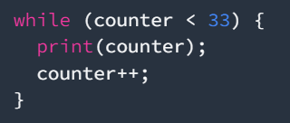

# Laporan Praktikum

Nama : Abima Fadricho Syuhadak  
NIM : 2241720025  
Kelas : TI 3B

## Module 2

Pengantar Bahasa Pemrograman Dart

## Soal
1.	Modifikasilah kode pada baris 3 di VS Code atau Editor Code favorit Anda berikut ini agar mendapatkan keluaran (output) sesuai yang diminta!

Output yang diminta:

Jawaban: 

2.	Mengapa sangat penting untuk memahami bahasa pemrograman Dart sebelum kita menggunakan framework Flutter ? Jelaskan!  
Jawaban: memahami Dart adalah fondasi utama sebelum kita bisa sepenuhnya menguasai Flutter. Dengan pemahaman yang kuat tentang Dart, kita akan lebih siap dan percaya diri dalam mengembangkan aplikasi Flutter yang kompleks dan efisien.

3.	Rangkumlah materi dari codelab ini menjadi poin-poin penting yang dapat Anda gunakan untuk membantu proses pengembangan aplikasi mobile menggunakan framework Flutter.  
Jawaban:  
1 Keunggulan Dart sebagai Bahasa Pemrograman:
Productive Tooling: Dart menyediakan alat pengembangan yang kuat, termasuk analisis kode, plugin IDE, dan ekosistem paket yang besar.
Garbage Collection: Memiliki manajemen memori otomatis untuk menangani objek yang tidak lagi digunakan.
Type Annotations (Opsional): Meningkatkan keamanan dan konsistensi tipe data, meskipun tidak wajib.
Statically Typed: Dart menggunakan type-safe dan type inference untuk menemukan bug saat kompilasi.
Portability: Dart dapat digunakan untuk pengembangan web, mobile, dan dikompilasi secara native untuk ARM dan x86.  
2 Evolusi Dart:
Peluncuran: Dart pertama kali diluncurkan pada tahun 2011 dan menjadi stabil pada 2013.
Perkembangan: Berfokus dari pengembangan web ke mobile, dengan Flutter sebagai framework utama.
Kekuatan dan Fleksibilitas: Menggabungkan type annotations opsional dengan fitur OOP untuk menjaga keseimbangan antara fleksibilitas dan ketangguhan.  
3 Cara Kerja Dart:
Eksekusi Kode: Dart dapat dijalankan melalui Dart VM (dengan JIT atau AOT) atau dikompilasi menjadi JavaScript.
JIT (Just-In-Time): Kode sumber dikompilasi sesuai kebutuhan, cocok untuk pengembangan dengan fitur debugging dan hot reload.
AOT (Ahead-Of-Time): Kode dikompilasi sebelumnya untuk performa yang lebih baik, namun tanpa dukungan fitur pengembangan seperti JIT.
4 Struktur Bahasa Dart:
Object-Oriented Programming (OOP): Dart mendukung OOP dengan fitur seperti enkapsulasi, inheritance, dan polymorphism.
Dart Operators:
Arithmetic Operators: Menyediakan operator dasar seperti +, -, *, /, dan lainnya.  
Increment & Decrement: Operator ++ dan -- untuk penambahan atau pengurangan nilai variabel.  
Equality & Relational Operators: Operator ==, !=, >, <, >=, <= untuk perbandingan nilai.  
Logical Operators: Operator logika seperti !, ||, dan && untuk evaluasi kondisi boolean.  
Dengan memahami poin-poin ini, Anda dapat lebih mudah mempelajari Dart dan menggunakannya secara efektif dalam pengembangan aplikasi menggunakan Flutter.
4.	Buatlah slide yang berisi penjelasan dan contoh eksekusi kode tentang perbedaan Null Safety dan Late variabel ! (Khusus soal ini kelompok berupa link google slide)  
Jawaban:  

