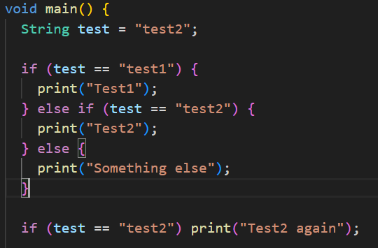
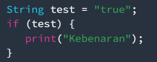
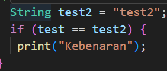

# Praktikum 1: Menerapkan Control Flows ("if/else)

### Selesaikan langkah-langkah praktikum berikut ini menggunakan DartPad di browser anda.

## Langkah 1:
Ketik atau salin kode program berikut ke dalam fungsi main()

## Langkah 2:
Silahkan coba eksekusi (Run) kode pada langkah 1 tersebut. Apa yang terjadi? Jelaskan!
### Jawab: 
Variabel test berisi "test2".       
Pada kondisi if, perbandingan dengan "test1" gagal, tetapi cocok dengan "test2", sehingga mencetak "Test2".     
Setelah itu, kondisi if (test == "test2") juga terpenuhi, sehingga mencetak "Test2 again".  

## Langkah 2:
Tambahkan kode program berikut, lalu coba eksekusi (Run) kode Anda.    
    
Apa yang terjadi ? Jika terjadi error, silakan perbaiki namun tetap menggunakan if/else.

