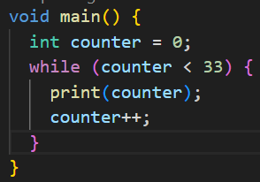
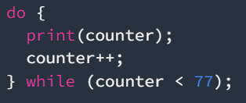

# Praktikum 2: Menerapkan Perulangan "while" dan "do-While"
Selesaikan langkah-langkah praktikum berikut ini menggunakan DartPad di browser anda.

## Langkah 1:
Ketik atau salin kode program berikut ke dalam fungsi main()

## Langkah 2: 
Silahkan coba eksekusi (Run) kode pada langkah 1 tersebut. Apa yang terjadi? Jelaskan! Lalu perbaiki jika error.
Perbaikan :     

kode tersebut menjalankan loop while yang mencetak nilai variabel couter dari 0 hingga 32.

## Langakah 3:
Tambahkan kode program berikut, lalu coba eksekusi (Run) kode anda.     
        
Apa yang terjadi? Jika terjadi error, silahkan perbaki namun tetap menggunakan do-while
## Jawab: 
kode tersebut meneruskan loop kode yang sebelumnya, sehingga output yang dikluarkan sampai dengan nomor 76.