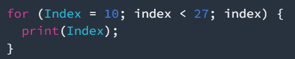
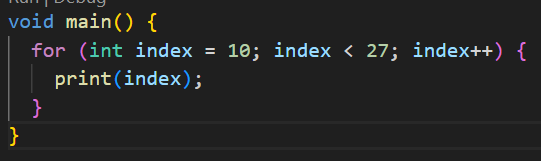

# Praktikum 3: Menerapkan perulangan "for" dan "break-continue"
Selesaikan langkah-langkah praktikum berikut ini menggunakan DartPad di browser anda.

## Langkah 1:
Ketik atau salin kode program berikut ke dalam fungsi main()
        

##Langkah 2:
Silahkan coba eksekusi (Run) kode pada langkah 1 tersebut. Apa yang terjadi? Jelaskan! Lalu perbaiki jika terjadi error.        
        
